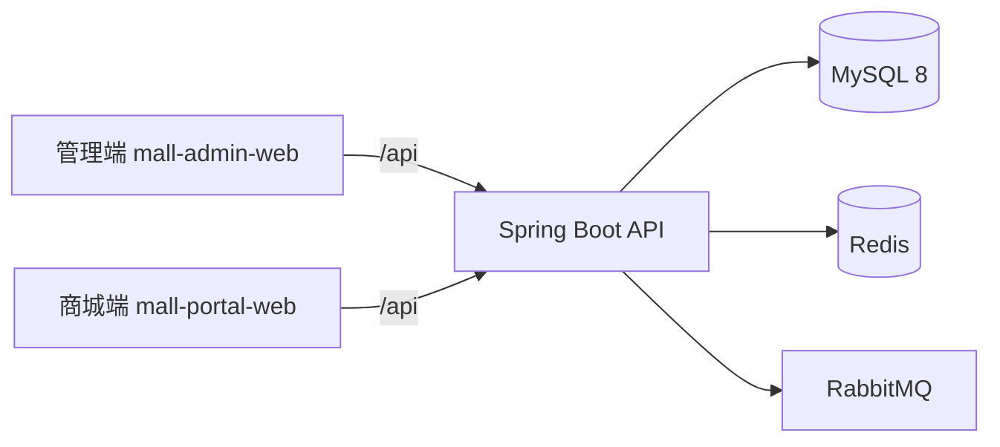

# Mall MVP

[](https://github.com/zh-eleven/mall/actions/workflows/ci.yml)

一个前后端分离的单体电商 MVP，包含 Spring Boot 后端、Vue 管理端和移动端 H5
商城。当前版本聚焦“浏览商品 → 加入购物车 → 提交订单 → 支付/取消 → 发货/收货
→ 退款”的核心闭环，以及支撑该闭环的后台商品、会员、订单和权限管理。

> 当前阶段：`v0.1.0 MVP`。适合学习、演示和继续开发，尚未按生产级电商系统完成
> 支付、营销、高可用、风控与可观测性建设。

## 当前进度

### 商城端

- 会员注册、登录、个人资料、密码和收货地址管理
- 商品分类树、商品列表、商品详情和 SKU 展示
- 购物车增删改查与选中状态维护
- 订单预览、幂等提交、分页查询、详情、取消和确认收货
- 测试支付状态流转（不接入真实支付渠道）
- 会员退款申请和订单退款状态展示

### 管理端

- 管理员登录、JWT 鉴权、角色/资源动态权限
- 管理员、角色和接口资源维护及授权
- 品牌、分类、属性、商品和 SKU 管理
- 会员查询、详情与启用/禁用
- 订单查询、详情与发货
- 退款查询、审核通过与拒绝

### 后端能力

- 统一 API 响应、分页结果、参数校验和全局异常处理
- MyBatis-Plus 数据访问与分页
- Redis 缓存商品分类树和商品详情
- RabbitMQ 订单超时消息，并由定时扫描提供补偿
- 数据库唯一约束保障订单提交幂等性
- 完整空库结构、RBAC、演示数据和本地管理员初始化脚本

## 技术栈

| 模块 | 技术 |
| --- | --- |
| 后端 | Java 21、Spring Boot 3.5、Spring Security、MyBatis-Plus、JWT |
| 数据与消息 | MySQL 8、Redis、RabbitMQ |
| 管理端 | Vue 3、TypeScript、Vite 7、Element Plus、Pinia |
| 商城端 | Vue 3、Vite 6、Vant 4、Vuex 4 |
| 工程化 | Maven Wrapper、npm、Docker Compose、Nginx、GitHub Actions |

## 架构



## 目录结构

```text
.
├── src/                         # Spring Boot 后端与测试
│   └── main/resources/sql/      # 建表、权限、演示数据脚本
├── mall-admin-web/              # Vue 3 管理端
├── mall-portal-web/             # Vue 3 移动端 H5 商城
├── compose.yaml                 # 本地容器编排
├── Dockerfile                   # 后端镜像
└── .github/workflows/ci.yml     # 三端持续集成
```

## 快速开始

### 1. 环境要求

- JDK 21
- MySQL 8.x
- Node.js 22.12+ 与 npm
- Docker / Docker Compose（用于 Redis、RabbitMQ 或整套应用）

### 2. 启动基础设施

MySQL 暂未包含在 `compose.yaml` 中，需要先在本机或其他主机准备 MySQL 8。
Redis 和 RabbitMQ 可以直接启动：

```bash
docker compose up -d redis rabbitmq
```

RabbitMQ 管理页为 <http://localhost:15672>，本地默认账号和密码均为 `mall`。

### 3. 初始化数据库

以下脚本均按当前代码模型维护。首次初始化建议按顺序执行：

```bash
mysql -u root -p < src/main/resources/sql/schema.sql
mysql -u root -p < src/main/resources/sql/rbac-data.sql
mysql -u root -p < src/main/resources/sql/demo-data.sql
mysql -u root -p < src/main/resources/sql/local-dev-admin.sql
```

已有数据库升级秒杀模块时，按顺序执行
`seckill-migration.sql` 和 `appendseckill.sql`；全新数据库的
`schema.sql` 与 `rbac-data.sql` 已包含秒杀表和权限数据。

也可以在 MySQL Workbench 或 IDEA Database 工具中按相同顺序执行。
`local-dev-admin.sql` 只允许用于本地开发。

### 4. 启动后端

必须提供数据库密码和 Base64 编码的 JWT 密钥。JWT 原始密钥至少 32 字节。

PowerShell 示例：

```powershell
$env:DB_USERNAME = "root"
$env:DB_PASSWORD = "你的数据库密码"
$env:JWT_SECRET = "你的 Base64 JWT 密钥"
.\mvnw.cmd spring-boot:run
```

macOS / Linux 示例：

```bash
export DB_USERNAME=root
export DB_PASSWORD='你的数据库密码'
export JWT_SECRET='你的 Base64 JWT 密钥'
bash ./mvnw spring-boot:run
```

后端默认运行在 <http://localhost:8080>。

### 5. 启动管理端

```bash
cd mall-admin-web
npm ci
npm run dev
```

访问 <http://localhost:5173>。

### 6. 启动商城端

```bash
cd mall-portal-web
npm ci
npm run dev
```

访问 <http://localhost:4949/mall/#/>。

## Docker Compose 启动全部应用

Compose 会启动后端、两个前端、Redis 和 RabbitMQ，但仍使用宿主机上的 MySQL。

```bash
cp .env.example .env.docker.local
# 修改 .env.docker.local 中的数据库密码和 JWT 密钥
docker compose up --build -d
```

Windows PowerShell 可使用：

```powershell
Copy-Item .env.example .env.docker.local
docker compose up --build -d
```

| 服务 | 地址 |
| --- | --- |
| 后端 API | <http://localhost:8080> |
| 管理端 | <http://localhost:8081> |
| H5 商城 | <http://localhost:8082/mall/#/> |
| RabbitMQ 管理页 | <http://localhost:15672> |

如果 MySQL 不在本机，请修改 `.env.docker.local` 中的
`SPRING_DATASOURCE_URL`。任何真实密码、Token 或生产密钥都不应提交到 Git。

## 本地演示账号

仅在执行对应 SQL 后可用：

| 入口 | 用户名 | 密码 | 来源 |
| --- | --- | --- | --- |
| 管理端 | `admin` | `123456` | `local-dev-admin.sql` |
| 商城端 | `demo_alice` | `123456` | `demo-data.sql` |

首次登录后请立即修改密码，生产环境禁止使用这些账号和初始化脚本。

## 配置项

| 环境变量 | 必填 | 默认值 | 说明 |
| --- | --- | --- | --- |
| `DB_USERNAME` | 否 | `root` | MySQL 用户名 |
| `DB_PASSWORD` | 是 | 无 | MySQL 密码 |
| `SPRING_DATASOURCE_URL` | 否 | 本机 `mall` 库 | JDBC 地址，容器运行时需要设置 |
| `JWT_SECRET` | 是 | 无 | 至少 32 字节随机值的 Base64 编码 |
| `REDIS_HOST` | 否 | `127.0.0.1` | Redis 地址 |
| `REDIS_PORT` | 否 | `6379` | Redis 端口 |
| `RABBITMQ_HOST` | 否 | `127.0.0.1` | RabbitMQ 地址 |
| `RABBITMQ_USERNAME` | 否 | `mall` | RabbitMQ 用户名 |
| `RABBITMQ_PASSWORD` | 否 | `mall` | RabbitMQ 密码 |

## 检查与构建

```bash
# 后端测试
bash ./mvnw test

# 管理端类型检查与生产构建
npm --prefix mall-admin-web run build

# 商城端代码检查、Node 测试与生产构建
npm --prefix mall-portal-web run lint
npm --prefix mall-portal-web run test:node
npm --prefix mall-portal-web run build:prod
```

GitHub Actions 会在 push 和 pull request 时并行执行以上检查。

## MVP 边界与下一步

当前未提供真实支付、优惠券、对象存储、消息通知、接口文档、端到端测试、
监控告警和生产部署方案。建议下一版优先补充：

1. OpenAPI 文档和 API 集成测试。
2. 支付回调验签与订单状态机进一步加固。
3. 优惠券，以及秒杀链路的压测、监控和生产化演练。
4. 文件存储、日志追踪、指标监控和生产配置分层。

## 开源来源与许可证

管理端基于 `macrozheng/mall-admin-web` 改造，保留 Apache License 2.0；商城端
基于 `wayn111/waynboot-mobile` 改造，保留 MIT License。完整说明见
[THIRD_PARTY_NOTICES.md](THIRD_PARTY_NOTICES.md) 及两个子目录中的许可证文件。

仓库根项目目前尚未声明统一开源许可证。在决定新增代码的授权方式前，请不要删除
或替换已有第三方许可证和版权声明。
